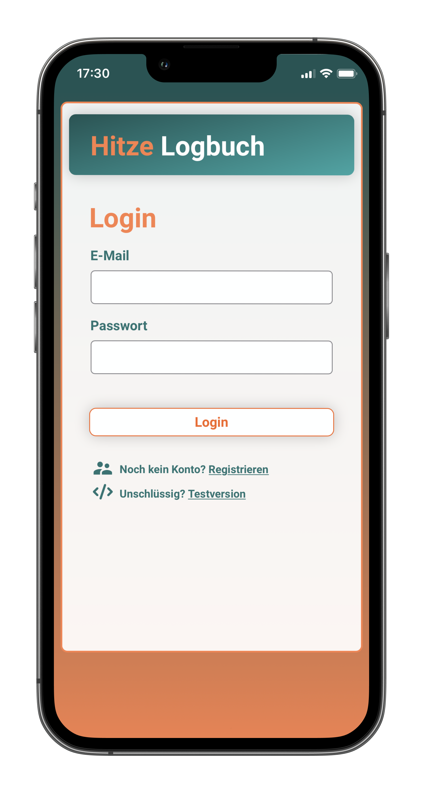
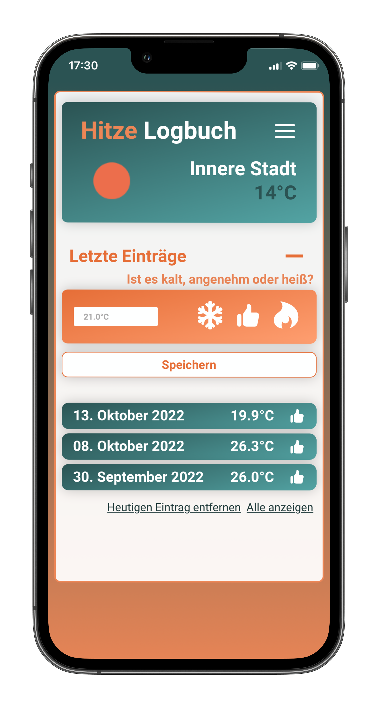
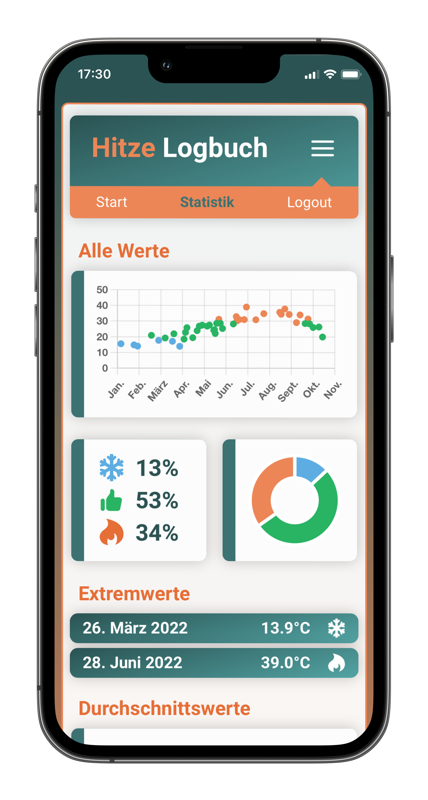

# Hitzelogbuch

A React app with a focus on mobile use to store a current temperature value with personal feedback (hot, cold, pleasant) on a daily basis. The data is stored in a Google Firebase realtime database and can be processed graphically using Chart.js.

https://heatdiary.schinaglp.com/

